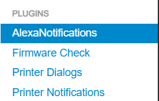
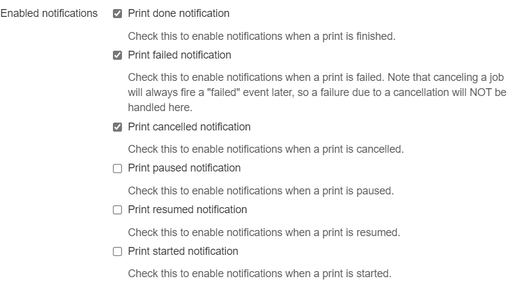
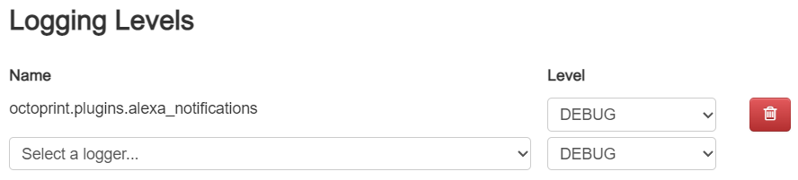

# Octoprint Alexa Notifications

A plugin for Octoprint to send notifications on the print status to Amazon Echo
devices via the Notify Me skill.

## Prerequisites  

* Enable [the Notify Me
  skill](https://www.amazon.com/Thomptronics-Notify-Me/dp/B07BB2FYFS) on your
  Amazon account 
  1. Follow the instructions to enable the skill and link your account
  2. Send a notification for the first time. You will receive an email in your
     inbox of the email address you used to register your Amazon account. The
     email contains a super long access code.

## Setup

Install via the bundled [Plugin
Manager](https://docs.octoprint.org/en/master/bundledplugins/pluginmanager.html) 
(NOT YET PUBLISHED) or manually using this URL:

    https://github.com/tautomer/OctoprintAlexaNotifications/archive/master.zip

## Configuration

1. Once the plugin is installed, you should see a new entry in the `PLUGINS`
   section in the settings, called `AlexaNotifications`.

   

2. Paste the access code in the settings of the plugin.

   

   Alternatively, you can modify the `config.yaml` file manually like the
   following example.

   ```yaml
   plugins:
     alexa_notifications:
       token: amzn1.ask.account.....
    ```

3. Check the print events that you want to be informed of.

   

   Again, you can manually modify the setting files to achieve this.

   ```yaml
   plugins:
     alexa_notifications:
       PrintCancelled: true
       PrintDone: true
       PrintFailed: true
       PrintPaused: false
       PrintResumed: false
       PrintStarted: false
    ```

4. You should be able to get a notification on your Echos with the information
   of the job name, elapsed time and error message. The latter two are only
   available for some events.


## Find a bug?

Feel free to open an issue, but before that, it would be great if you can enable
the debug output for this plugin like below.



# TODO

* [ ] Report unrecoverable errors
* [ ] Avoid sending notifications to the server too frequently